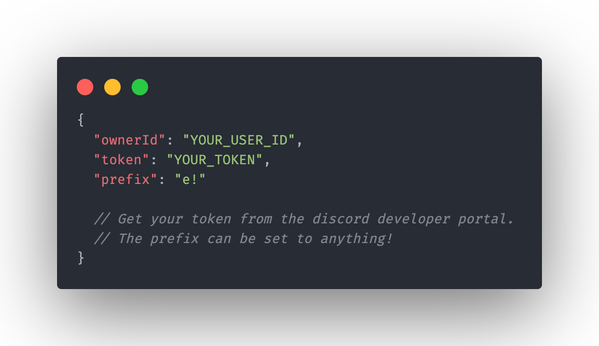

# 👽 eTOA-001

## Note

This project is no longer maintained and uses an outdated version of Discord.js. Instead, [Quabos](https://github.com/ohmrr/quabos) is the successor of eTOA-001.

## A multi-purpose Discord bot made with Discord.js v13

### Installation:

You will need to install: [Node.JS](https://nodejs.org/en/download) - specifically version 16.6.0 or newer. You can use the node package manager (NPM) to install all the dependencies.

<br />

You will also need: [Discord.js](https://discord.js.org/#/docs/main/stable/general/welcome) - with the newest version version 13.3.1. I believe version 13 or higher will be good enough though. You can install the latest version by running the following command in the terminal:

```
npm install discord.js
yarn add discord.js
```

### Use:

Go to the Data folder in src. Then, inside the folder, create "config.json". You will need to add a prefix (e!) and a token, which you get from the Discord Developer Portal. Never share your token with anyone. You can also add your own Id to the ownerId section. This is recommended, as some commands check to make sure that you own the bot.


